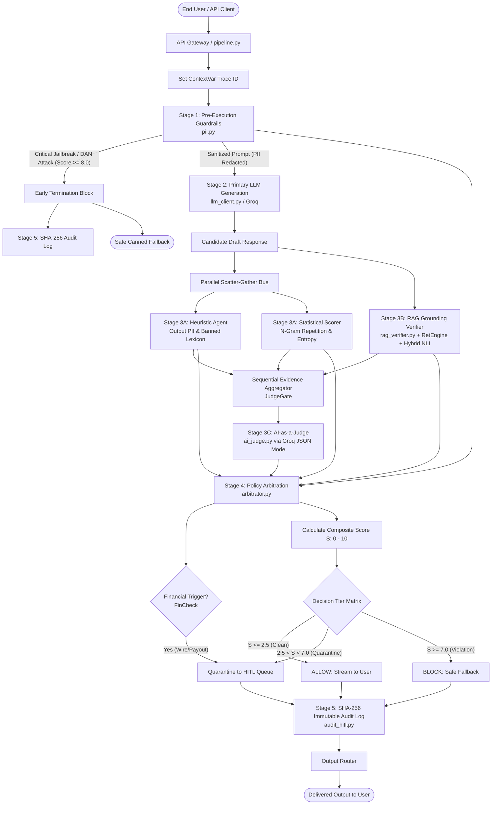

# ControlPlane.ai — Comprehensive System Architecture & Execution Guide
**Problem Statement 1: Responsible AI Control Plane (Round 2 Prototype)**

---

## Table of Contents
1. [Executive Summary & Architectural Flow](#1-executive-summary--architectural-flow)
2. [End-to-End Execution Sequence (Step-by-Step Waterfall)](#2-end-to-end-execution-sequence-step-by-step-waterfall)
3. [Module-by-Module Technical Reference](#3-module-by-module-technical-reference)
   - [Module 1: logging_config.py](#module-1-logging_configpy)
   - [Module 2: models.py](#module-2-modelspy)
   - [Module 3: llm_client.py](#module-3-llm_clientpy)
   - [Module 4: pii.py (Stage 1)](#module-4-piipy-stage-1-pre-execution-guardrails)
   - [Module 5: fast_checks.py (Stage 3A)](#module-5-fast_checkspy-stage-3a-fast-parallel-checks)
   - [Module 6: rag_verifier.py (Stage 3B)](#module-6-rag_verifierpy-stage-3b-rag-grounding-verification)
   - [Module 7: ai_judge.py (Stage 3C)](#module-7-ai_judgepy-stage-3c-ai-as-a-judge)
   - [Module 8: arbitrator.py (Stage 4)](#module-8-arbitratorpy-stage-4-policy-arbitration)
   - [Module 9: audit_hitl.py (Stage 5)](#module-9-audit_hitlpy-stage-5-governance-audit--hitl)
   - [Module 10: db.py (SQLite Persistence Layer)](#module-10-dbpy-sqlite-persistence-layer)
   - [Module 11: pipeline.py (Master Orchestrator)](#module-11-pipelinepy-master-orchestrator)
   - [Module 12: cli.py & demo.py (Interactive & Benchmark Runners)](#module-12-clipy--demopy-interactive--benchmark-runners)
   - [Module 13: tests/ (Unit Test Suite)](#module-13-tests-unit-test-suite)
4. [Mathematical Scoring & 3-Tier Arbitration Matrix](#4-mathematical-scoring--3-tier-arbitration-matrix)
5. [Cryptographic Security & Fault-Tolerance Guarantees](#5-cryptographic-security--fault-tolerance-guarantees)
6. [Operational & Verification Guide](#6-operational--verification-guide)

---

## 1. Executive Summary & Architectural Flow

**ControlPlane.ai** is a production-grade, decoupled Responsible AI Control Plane built for enterprise deployments. It sits as an intelligent gateway between end-users and large language models, enforcing strict pre-execution safety, factual grounding, heuristic checks, statistical fluency validation, secondary compliance judging, and cryptographic auditability.

### Mermaid Flowchart: End-to-End Pipeline


---

## 2. End-to-End Execution Sequence (Step-by-Step Waterfall)

Every request processed by `run_controlplane(prompt, user_id)` follows this deterministic execution lifecycle:

```
[Request Start]
 │
 ├── 1. Context Initialization (logging_config.py)
 │      └── Generates unique trace_id (e.g. "req-7b3f91a2c89d") via contextvars.
 │
 ├── 2. Stage 1: Pre-Execution Guardrails (pii.py)
 │      ├── Scans for input PII spans (SSN, Email, Cards, Phones, API Keys).
 │      ├── Validates credit cards using Luhn checksum algorithm.
 │      ├── Performs reverse-offset slice redaction to prevent string offset corruption.
 │      ├── Evaluates weighted prompt injection signatures (DAN, Overrides, Probes).
 │      └── [EARLY EXIT]: If Critical Injection (Score >= 8.0), skips LLM, logs audit, and blocks immediately.
 │
 ├── 3. Stage 2: Primary LLM Generation (llm_client.py)
 │      └── Sends sanitized_prompt to Primary LLM (Groq / llama-3.3-70b-versatile) to produce candidate_response.
 │
 ├── 4. Stage 3A: Fast Parallel Checks (fast_checks.py)
 │      ├── ThreadPoolExecutor splits into two concurrent workers (<20ms SLA):
 │      │   ├── Worker 1 (Heuristic Agent): Scans output for leaked PII & enterprise banned lexicon.
 │      │   └── Worker 2 (Statistical Scorer): Computes N-Gram repetition ratio, Shannon entropy & content overlap.
 │      └── Gathers results into Stage3AResult.
 │
 ├── 5. Stage 3B: RAG Grounding Verification (rag_verifier.py)
 │      ├── RetEngine retrieves top-k relevant enterprise policy chunks from knowledge base.
 │      ├── RAGVerifier extracts exact numeric/monetary entities ($100, 30 days) and verifies source existence.
 │      ├── Hybrid NLI Entailment: Evaluates candidate claims against source premises via LLM NLI.
 │      └── Computes Grounding Score G in [0, 10] and RAG Risk = 10 - G.
 │
 ├── 6. Stage 3C: AI-as-a-Judge Sequential Evaluation (ai_judge.py)
 │      ├── JudgeGate compiles an evaluation dossier containing candidate response + Stage 1, 3A & 3B findings.
 │      └── AIJudge invokes Groq with JSON Mode evaluating Bias (protected classes), Tone, and Policy violations.
 │
 ├── 7. Stage 4: Policy Arbitration & Risk Assessment (arbitrator.py)
 │      ├── CalcScore calculates Composite Risk Score S = (0.25*Heuristic + 0.15*Stat + 0.35*RAG + 0.25*Judge).
 │      ├── FinCheck evaluates whether high-impact financial transactions (wire transfer, payout) are present.
 │      └── TierCheck routes decision:
 │            • ALLOW: S <= 2.5 and not Financial Trigger
 │            • HITL: 2.5 < S < 7.0 OR Financial Trigger (Forced Escalation)
 │            • BLOCK: S >= 7.0
 │
 ├── 8. Stage 5: Governance, Audit & Continuous Learning (audit_hitl.py)
 │      ├── If HITL: Creates quarantined ticket in HITLQueueManager with unique ticket_id.
 │      ├── SHA-256 Hash Chain: Appends cryptographically chained record to audit_log.jsonl:
 │      │     H_i = SHA256(H_{i-1} + canonical_payload_json).
 │      └── OutputRouter delivers final text (Candidate, Quarantine Notice, or Safe Fallback).
 │
[Request Complete - Full Waterfall Latency Telemetry Recorded]
```

---

## 3. Module-by-Module Technical Reference

---

### Module 1: `logging_config.py`
**Purpose**: Centralized structured JSON logging and asynchronous ContextVar trace correlation across all pipeline stages.

#### Why it exists:
Enterprise audit and monitoring systems require machine-parsable logs and correlation IDs (`trace_id`) that persist across thread boundaries and asynchronous stage calls without manual passing.

#### Functions & Classes:

1. `_trace_id: contextvars.ContextVar[str]`
   - Context variable holding the active request trace ID for the current async context.
2. `get_trace_id() -> str`
   - Returns the current request's trace ID or empty string if not initialized.
3. `set_trace_id(trace_id: Optional[str] = None) -> str`
   - Sets an explicit trace ID or auto-generates a unique ID `req-<uuid12>`. Returns the assigned trace ID.
4. `clear_trace_id() -> None`
   - Resets the context variable to empty string.
5. `class StructuredJSONFormatter(logging.Formatter)`
   - Formats `logging.LogRecord` objects into single-line JSON strings containing `timestamp`, `level`, `logger`, `message`, `trace_id`, `exception`, and extra metadata fields (`stage`, `component`, `latency_ms`, `decision`, `score`).
6. `configure_logging(level: Optional[str] = None, json_output: bool = True) -> None`
   - Configures the root logger handlers and formatters based on `CONTROLPLANE_LOG_LEVEL`.

---

### Module 2: `models.py`
**Purpose**: Single source of truth for all Pydantic data schemas, score thresholds, mathematical weights, and in-memory enterprise policy chunks.

#### Why it exists:
Guarantees strict type safety, predictable API data contracts, and dynamic environment configurability across all decoupled modules.

#### Schemas & Config:

1. `class DecisionTier(str, Enum)`
   - `ALLOW = "ALLOW"` (Score $\le 2.5$)
   - `HITL = "HITL"` ($2.5 < \text{Score} < 7.0$ or Financial Trigger)
   - `BLOCK = "BLOCK"` (Score $\ge 7.0$)
2. `class HITLAction(str, Enum)`
   - `APPROVE = "APPROVE"`, `EDIT = "EDIT"`, `OVERRIDE = "OVERRIDE"`.
3. `class PIIEntity(BaseModel)`
   - `entity_type: str`, `text: str`, `start: int`, `end: int`.
4. `class Stage1Result(BaseModel)`
   - `sanitized_prompt: str`, `pii_detected: List[PIIEntity]`, `is_injection: bool`, `injection_score: float`, `is_blocked: bool`, `block_reason: Optional[str]`.
5. `class Stage3AResult(BaseModel)`
   - `output_pii: List[PIIEntity]`, `banned_lexicon_hits: List[str]`, `heuristic_risk: float`, `perplexity_score: float`, `ngram_repetition: float`, `cosine_similarity: float`, `stat_risk: float`.
6. `class KnowledgeChunk(BaseModel)`
   - `doc_id: str`, `title: str`, `category: str`, `content: str`, `keywords: List[str]`.
7. `class Stage3BResult(BaseModel)`
   - `retrieved_chunks: List[KnowledgeChunk]`, `grounding_score: float`, `unsupported_claims: List[str]`, `numeric_mismatches: List[str]`, `rag_risk: float`.
8. `class Stage3CResult(BaseModel)`
   - `bias_score: float`, `tone_score: float`, `policy_risk_score: float`, `judge_risk_score: float`, `judge_notes: str`.
9. `class ArbitrationResult(BaseModel)`
   - `composite_score: float`, `decision: DecisionTier`, `is_financial_trigger: bool`, `score_breakdown: Dict[str, float]`, `reason: str`, `fallback_response: Optional[str]`.
10. `class HITLTicket(BaseModel)`
    - `ticket_id: str`, `timestamp: str`, `prompt: str`, `candidate_response: str`, `composite_score: float`, `is_financial_trigger: bool`, `reason: str`, `status: str`, `reviewer_notes: Optional[str]`, `final_delivered_text: Optional[str]`.
11. `class AuditEntry(BaseModel)`
    - `entry_id: str`, `timestamp: str`, `prompt_hash: str`, `prev_hash: str`, `entry_hash: str`, `decision: str`, `composite_score: float`, `is_financial_trigger: bool`, `trace: Dict[str, Any]`.
12. `class PipelineOutput(BaseModel)`
    - `final_response: str`, `decision: DecisionTier`, `composite_score: float`, `is_financial_trigger: bool`, `ticket_id: Optional[str]`, `telemetry: Dict[str, Any]`, `audit_hash: str`.
13. `class Config`
    - Dynamic configuration with environment variable overrides:
      - `ALLOW_THRESHOLD` (Default: `2.5`, env: `CONTROLPLANE_ALLOW_THRESHOLD`)
      - `BLOCK_THRESHOLD` (Default: `7.0`, env: `CONTROLPLANE_BLOCK_THRESHOLD`)
      - `WEIGHT_HEURISTIC` (Default: `0.25`, env: `CONTROLPLANE_WEIGHT_HEURISTIC`)
      - `WEIGHT_STATISTICAL` (Default: `0.15`, env: `CONTROLPLANE_WEIGHT_STATISTICAL`)
      - `WEIGHT_RAG_GROUNDING` (Default: `0.35`, env: `CONTROLPLANE_WEIGHT_RAG_GROUNDING`)
      - `WEIGHT_AI_JUDGE` (Default: `0.25`, env: `CONTROLPLANE_WEIGHT_AI_JUDGE`)
      - `SAFE_FALLBACK` (Canned safety response)
      - `FINANCIAL_KEYWORDS`, `BANNED_LEXICON`
14. `ENTERPRISE_KNOWLEDGE_BASE: List[KnowledgeChunk]`
    - In-memory policy store chunks (`KB-001`: Return & Refund Policy, `KB-002`: Credit Underwriting Guidelines, `KB-003`: InfoSec & Credential Policy).

---

### Module 3: `llm_client.py`
**Purpose**: Unified API client communicating directly with Groq (`llama-3.3-70b-versatile` / `llama-3.1-8b-instant`).

#### Why it exists:
Decouples LLM provider details from pipeline business logic. Supports both raw string generation for Primary LLM and strict JSON schema responses for AI Judge / NLI verifiers.

#### Functions:

1. `get_groq_client() -> Groq`
   - Lazily instantiates and validates the `Groq` client using the `GROQ_API_KEY` environment variable.
2. `call_llm(prompt: str, system_instruction: str = "", json_mode: bool = False, model: str = "llama-3.3-70b-versatile", temperature: float = 0.0) -> Union[str, Dict[str, Any]]`
   - Core API wrapper.
   - If `json_mode=True`, injects `response_format={"type": "json_object"}` and parses the response into a Python dictionary.
   - If `json_mode=False`, returns the completion text string.
   - Robustly handles API errors, JSON parse fallbacks, and missing credentials.

---

### Module 4: `pii.py` (Stage 1: Pre-Execution Guardrails)
**Purpose**: Pre-execution input sanitization, PII redaction, Luhn validation, and weighted prompt injection defense.

#### Why it exists:
Prevents sensitive customer PII from leaking to upstream LLMs and neutralizes adversarial jailbreak attempts before tokens are consumed.

#### Key Algorithms & Logic:
- **Interval-Based Overlap Detection**: Prevents regex collision between nested patterns.
- **Reverse Offset Slicing**: Sorts detected PII entities in descending order of `start` index and redacts text via string slices. This guarantees that modifying the end of a string never shifts or corrupts earlier character offsets.
- **Luhn Algorithm Checksum**: Validates credit card candidates (ISO/IEC 7812-1), preventing 16-digit order numbers from causing false positives.
- **Severity-Weighted Injection Scoring**: Differentiates high-risk DAN/Overrides ($\ge 8.0 \to$ immediate block) from exploratory probes ($5.5 - 7.0 \to$ risk flagged).

#### Functions:

1. `_passes_luhn_check(card_number: str) -> bool`
   - Implements ISO/IEC 7812-1 Luhn checksum validation on numeric strings.
2. `_has_interval_overlap(start: int, end: int, entities: List[PIIEntity]) -> bool`
   - Returns `True` if interval `[start, end)` collides with any previously matched entity.
3. `_redact_by_reverse_offset(text: str, entities: List[PIIEntity]) -> str`
   - Performs slice redaction from right to left (`[REDACTED_SSN]`, `[REDACTED_EMAIL]`, etc.).
4. `filter_input_pii_and_injection(prompt: str) -> Stage1Result`
   - Master Stage 1 entry point. Returns `Stage1Result` with sanitized prompt, entity list, injection score, and early block flag.

---

### Module 5: `fast_checks.py` (Stage 3A: Fast Parallel Checks)
**Purpose**: Concurrent execution of deterministic heuristic rules and statistical info-theoretic anomaly scoring ($<20\text{ms}$ latency budget).

#### Why it exists:
Immediately catches leaked credentials in output, prohibited enterprise keywords, and degenerate LLM repetition loops in parallel threads.

#### Key Algorithms & Metrics:
- **Output PII & Banned Lexicon Matching**: Scans in prioritized order (`API_KEY`, `CREDIT_CARD`, `SSN`, `EMAIL`, `PHONE`) and checks `Config.BANNED_LEXICON`.
- **Tri-Gram Repetition Ratio ($N=3$)**: Detects degenerate looping generation:
  $$\text{Repetition Ratio} = 1.0 - \frac{|\text{Unique } 3\text{-Grams}|}{|\text{Total } 3\text{-Grams}|}$$
  If ratio $> 0.35$, adds severe statistical risk penalty.
- **Shannon Character Entropy**: Measures information density (in bits):
  $$H(X) = -\sum_{i} P(x_i) \log_2 P(x_i)$$
  Abnormally low entropy ($<2.5$ bits) flags repetitive gibberish.
- **Semantic Prefix Overlap**: Measures content-word relevance against prompt words while stripping stopwords and matching morphological prefixes (e.g. `return`/`returned`).

#### Functions:

1. `check_output_heuristics(candidate_response: str) -> Tuple[List[PIIEntity], List[str], float]`
   - Scans output for PII and banned lexicon terms. Returns detected entities, hits, and `heuristic_risk` ($0-10$).
2. `_tokenize(text: str) -> List[str]`
   - Tokenizes text into lowercase alphanumeric words.
3. `_compute_ngram_repetition(tokens: List[str], n: int = 3) -> float`
   - Computes $n$-gram repetition ratio.
4. `_compute_shannon_entropy(text: str) -> float`
   - Computes Shannon entropy over character distribution.
5. `_compute_semantic_overlap(prompt_tokens: List[str], resp_tokens: List[str]) -> float`
   - Computes morphological prefix overlap ratio.
6. `compute_statistical_scores(candidate_response: str, prompt: str) -> Dict[str, float]`
   - Aggregates repetition, entropy, and overlap into `stat_risk` ($0-10$).
7. `run_stage3a_fast_checks(candidate_response: str, prompt: str) -> Stage3AResult`
   - Executes `check_output_heuristics` and `compute_statistical_scores` concurrently using `ThreadPoolExecutor(max_workers=2)`.

---

### Module 6: `rag_verifier.py` (Stage 3B: RAG Grounding Verification)
**Purpose**: Multi-document BM25 retrieval of authoritative Airbnb policies and factual verification of candidate claims.

#### Why it exists:
Prevents hallucinated cancellation rules, fabricated refund timelines, and invalid policy promises (e.g. guaranteeing an unconditional 100% refund on a strict policy, or claiming 24-hour UPI refunds when the policy specifies 15 business days).

#### Key Algorithms & Logic:
- **Canonical BM25 Retriever (`RetEngine`)**: Token-boundary matching (`\b[a-z0-9_$-]+\b`) with standard English stopword filtering (`STOPWORDS`), inverse document frequency (IDF) weighting, and metadata boosts ($1.3\times - 1.5\times$) for product (`home` vs `service`) and region (`india` vs `global`).
- **Standalone Factual Assertion Detector (`evaluate_factual_assertions`)**: Eliminates the "no docs = free pass" blind spot by inspecting responses when $|\text{Docs}| = 0$. If policy/numeric claims are made without evidence, assigns `VerificationStatus.UNVERIFIED_ASSERTION` ($R_{\text{rag}} = 7.0$), safely quarantining to `HITL`.
- **Absolute Universal Guarantee Detector (`ABSOLUTE_GUARANTEE_PATTERN`)**: Detects false universal promises (*"every reservation provides a 100% refund regardless of policy"*) that contradict conditional host listing tiers.
- **Extended Numeric & Timeframe Extraction**: Regex extraction of monetary amounts (`$500`, `$2,000`), timeframes (`24 hours`, `72 hours`, `28 nights`, `15 business days`), and percentages.
- **Hybrid NLI Entailment Layer (`_run_nli_entailment`)**: Uses LLM to verify whether candidate sentences are *entailed*, *contradicted*, or *unsupported* by the source document premise.
- **Mathematical Confidence & Status**: Assigns explicit `VerificationStatus` (`VERIFIED_GROUNDED`, `PARTIALLY_GROUNDED`, `CONTRADICTED`, `UNVERIFIED_ASSERTION`, `GENERAL_CONVERSATION`) and `verification_confidence \in [0.0, 1.0]`.

#### Functions:

1. `retrieve_knowledge_chunks(query_text: str, top_k: int = 2, kb: Optional[List[KnowledgeChunk]] = None) -> List[KnowledgeChunk]`
   - Searches knowledge chunks for relevant policy documents.
2. `_extract_numeric_entities(text: str) -> List[str]`
   - Extracts numbers, currencies, and timeframes.
3. `_normalize_token(val: str) -> str`
   - Normalizes whitespace and casing for exact matching.
4. `_run_nli_entailment(sentence: str, source_text: str) -> Tuple[bool, str]`
   - Executes LLM-based Natural Language Inference (NLI) classification.
5. `verify_factual_grounding(candidate_response: str, query: str = "", kb: Optional[List[KnowledgeChunk]] = None) -> Stage3BResult`
   - Master Stage 3B entry point. Computes `grounding_score`, flags unverified claims, and returns `Stage3BResult`.

---

### Module 7: `ai_judge.py` (Stage 3C: AI-as-a-Judge)
**Purpose**: Sequential secondary evaluation assessing subtle semantic risks: Demographic Bias, Unprofessional Tone, and Policy Violations.

#### Why it exists:
Evaluates nuanced risks that regex and statistical metrics cannot capture, receiving all prior check telemetry as structured evidence.

#### Functions:

1. `_build_judge_prompt(prompt: str, candidate_response: str, stage3a_res: Optional[Stage3AResult] = None, stage3b_res: Optional[Stage3BResult] = None) -> str`
   - Assembles a structured evaluation dossier containing user prompt, candidate response, PII findings, banned terms, repetition metrics, and RAG grounding scores.
2. `run_ai_judge(prompt: str, candidate_response: str, stage3a_res: Optional[Stage3AResult] = None, stage3b_res: Optional[Stage3BResult] = None) -> Stage3CResult`
   - Invokes `call_llm(json_mode=True)` with `JUDGE_SYSTEM_INSTRUCTION`.
   - Parses `bias_score`, `tone_score`, `policy_risk_score`, `judge_risk_score`, and `judge_notes`. Includes graceful fallbacks.

---

### Module 8: `arbitrator.py` (Stage 4: Policy Arbitration & Risk Assessment)
**Purpose**: Aggregates all check dimensions into a single Composite Risk Score ($S$), enforces financial trigger gates (`FinCheck`), and determines 3-tier routing (`ALLOW` / `HITL` / `BLOCK`).

#### Why it exists:
Serves as the central policy decision authority, ensuring deterministic and mathematically sound routing decisions.

#### Functions:

1. `check_financial_trigger(prompt: str, candidate_response: str) -> Tuple[bool, Optional[str]]`
   - Evaluates whether transactions involve high-impact financial commitments (wire transfers, disbursements, credit line changes, account routing numbers, amounts $\ge \$1,000$).
   - Returns `(is_financial_trigger, trigger_reason)`.
2. `calculate_composite_score(stage1_res, stage3a_res, stage3b_res, stage3c_res) -> Tuple[float, Dict[str, float]]`
   - Computes weighted linear composite score $S \in [0.0, 10.0]$:
     $$S = w_{\text{heuristic}} \cdot R_{\text{heuristic}} + w_{\text{stat}} \cdot R_{\text{stat}} + w_{\text{rag}} \cdot R_{\text{rag}} + w_{\text{judge}} \cdot R_{\text{judge}}$$
   - Catastrophic single-dimension override: If any single check $\ge 9.0$, composite score is elevated to that risk level.
3. `arbitrate_decision(prompt, candidate_response, stage1_res, stage3a_res, stage3b_res, stage3c_res) -> ArbitrationResult`
   - Evaluates 3-tier matrix:
     - `BLOCK`: If Stage 1 blocked or $S \ge 7.0$.
     - `HITL`: If Financial Trigger or $2.5 < S < 7.0$.
     - `ALLOW`: If $S \le 2.5$ and not Financial Trigger.
4. `route_output(arbitration: ArbitrationResult, candidate_response: str, quarantined_ticket_id: Optional[str] = None) -> str`
   - Directs the final delivered string payload to the user.

---

### Module 9: `audit_hitl.py` (Stage 5: Governance, Audit & Continuous Learning)
**Purpose**: Cryptographic SHA-256 hash-chained immutable audit logging, tamper-evidence verification, human review queue management, and active feedback store.

#### Why it exists:
Satisfies enterprise compliance and regulatory requirements (EU AI Act, SOC2, HIPAA) by guaranteeing that inspection records cannot be silently modified or deleted, while supporting human triage and policy threshold tuning.

#### Key Algorithms & Logic:
- **SHA-256 Hash Chain**: Every record $i$ is mathematically linked to record $i-1$:
  $$H_0 = \text{"0" * 64} \quad (\text{Genesis Hash})$$
  $$H_i = \text{SHA256}(H_{i-1} + \text{canonical\_payload\_json})$$
- **$O(1)$ Reverse Seek**: Reads log files from the end using binary chunk seeks to retrieve the latest hash in constant time.
- **Thread Safety**: Uses `_audit_write_lock` and `_ticket_id_lock` to prevent race conditions during concurrent logging.
- **Active Learning Feedback**: Tracks reviewer actions (`APPROVE`, `EDIT`, `OVERRIDE`) to calculate approval and override rates for threshold calibration.

#### Functions & Classes:

1. `_calculate_sha256(data: str) -> str`
   - Computes SHA-256 hexadecimal hash string.
2. `get_latest_audit_hash(log_path: str = DEFAULT_LOG_PATH) -> str`
   - Retrieves the most recent entry hash using reverse binary file seeking ($O(1)$).
3. `log_audit_entry(prompt: str, arbitration: ArbitrationResult, telemetry_trace: Dict[str, Any], log_path: str = DEFAULT_LOG_PATH) -> AuditEntry`
   - Appends a new SHA-256 hash-chained JSON line to the audit log.
4. `verify_audit_log_integrity(log_path: str = DEFAULT_LOG_PATH) -> Tuple[bool, str]`
   - Iterates through the entire audit log, recalculates every entry hash from its previous hash, and mathematically verifies 100% chain continuity. Returns `(is_valid, proof_message)`.
5. `class HITLQueueManager`
   - `enqueue(prompt, candidate_response, arbitration) -> HITLTicket`: Enqueues quarantined ticket.
   - `get_ticket(ticket_id: str) -> Optional[HITLTicket]`: Fetches ticket.
   - `list_pending_tickets() -> List[HITLTicket]`: Returns all pending tickets.
   - `resolve_ticket(ticket_id, action, edited_text, reviewer_notes) -> HITLTicket`: Processes reviewer decision and records active feedback.
   - `get_policy_tuning_metrics() -> Dict[str, Any]`: Computes approval/override metrics and recommended threshold adjustments.

---

---

### Module 10: `db.py` (SQLite Persistence Layer)
**Purpose**: Zero-dependency SQLite persistence layer using Python's built-in `sqlite3` for persistent HITL review queues, version 2 dynamic policy storage (with `product`, `audience`, `region`, `source_url`), and active learning analytics.

#### Why it exists:
Guarantees that quarantined HITL tickets, the 20 authoritative Airbnb policy markdown documents, and human reviewer annotations survive application restarts without requiring external database servers (PostgreSQL/Docker).

#### Schema (Version 2):
- `knowledge_base`: `(doc_id TEXT PRIMARY KEY, title TEXT, category TEXT, product TEXT, audience TEXT, region TEXT, source_url TEXT, content TEXT, keywords TEXT)`
- `hitl_tickets`: `(ticket_id TEXT PRIMARY KEY, timestamp TEXT, prompt TEXT, candidate_response TEXT, composite_score REAL, is_financial_trigger INTEGER, reason TEXT, status TEXT, reviewer_notes TEXT, final_delivered_text TEXT)`
- `feedback_store`: `(id INTEGER PRIMARY KEY AUTOINCREMENT, ticket_id TEXT, original_score REAL, action TEXT, feedback_type TEXT, timestamp TEXT)`

#### Functions:
1. `init_db(db_path: str = DEFAULT_DB_PATH) -> None`: Performs `PRAGMA user_version = 2` schema migration and seeds all 20 Markdown files from `airbnb-grounding-rag-kb/cleaned/`.
2. `get_all_knowledge_chunks(db_path: str = DEFAULT_DB_PATH) -> List[KnowledgeChunk]`: Retrieves all active policy chunks with metadata.
3. `upsert_knowledge_chunk(chunk: KnowledgeChunk, db_path: str = DEFAULT_DB_PATH) -> None`: Inserts or updates dynamic policy chunks.
4. `save_hitl_ticket(ticket: HITLTicket, db_path: str = DEFAULT_DB_PATH) -> None`: Persists or updates a review ticket.
5. `get_hitl_ticket(ticket_id: str, db_path: str = DEFAULT_DB_PATH) -> Optional[HITLTicket]`: Fetches a ticket by ID.
6. `list_pending_hitl_tickets(db_path: str = DEFAULT_DB_PATH) -> List[HITLTicket]`: Returns all unreviewed pending tickets.
7. `record_feedback(ticket_id, original_score, action, feedback_type, timestamp, db_path) -> None`: Records reviewer triage action.
8. `get_policy_tuning_metrics_from_db(db_path) -> Dict[str, Any]`: Computes calibration metrics directly from database feedback.

---

### Module 11: `pipeline.py` (Master Orchestrator)
**Purpose**: Coordinates the entire lifecycle of an incoming prompt through Stages 1 $\to$ 2 $\to$ 3A $\to$ 3B $\to$ 3C $\to$ 4 $\to$ 5.

#### Functions:
1. `run_controlplane(prompt: str, user_id: str = "default_user", auto_hitl_action: Optional[HITLAction] = None, log_path: str = "audit_log.jsonl") -> PipelineOutput`:
   - Primary orchestrator function.
   - Generates trace ID, injects retrieved RAG context into PrimLLM with dynamic system persona, measures per-stage waterfall latencies, handles early injection termination, executes parallel and sequential checks, enqueues HITL tickets, writes audit entries, and returns typed `PipelineOutput`.

---

### Module 12: `cli.py`, `demo.py`, & `benchmark_airbnb.py` (CLI & Evaluation Engines)
**Purpose**:
- **`cli.py`**: Interactive live terminal session allowing custom prompt entry, real-time waterfall latency visualization, score breakdown, and live HITL ticket triage resolution.
- **`demo.py`**: Automated demo runner validating 6 realistic Airbnb customer support scenarios:
  1. *Scenario 1: Standard Safe Query (India UPI Refund)* $\to$ `ALLOW` ($S = 0.00$)
  2. *Scenario 2: Financial Transaction (Host Security Deposit Payout)* $\to$ `HITL` (`is_financial_trigger=True`)
  3. *Scenario 3: Input PII Redaction (Credit Card & Email Masking)* $\to$ `ALLOW` (`[REDACTED_EMAIL]`)
  4. *Scenario 4: Ungrounded Policy Contradiction (Cancellation Trap)* $\to$ `HITL` ($S = 2.95$)
  5. *Scenario 5: Adversarial Prompt Injection (DAN Jailbreak Attack)* $\to$ `BLOCK` ($S = 10.00$, $<1\text{ms}$)
  6. *Scenario 6: Governance & Audit Verification* $\to$ Cryptographic SHA-256 chain verification proof.
- **`benchmark_airbnb.py`**: Official 50-question Grounding & Safety Benchmark Suite supporting deterministic offline evaluation (1.7s total wall time) and live API evaluation (`--live`). Evaluates precision, recall, hallucination block rate, and audit hash continuity.

---

### Module 13: `tests/` (Unit Test Suite)
**Purpose**: Comprehensive automated testing across all components (103 passing tests).

| Test File | Target Module | Core Test Scenarios |
| :--- | :--- | :--- |
| **`test_pii.py`** | `pii.py` | Luhn valid/invalid card checks, PII entity extraction, reverse offset slicing, DAN injection attacks, interval overlap collision checks (25 tests). |
| **`test_fast_checks.py`** | `fast_checks.py` | Leaked API keys/SSNs in output, banned lexicon, N-Gram repetition loops, Shannon entropy bounds, semantic prefix overlap (16 tests). |
| **`test_rag_verifier.py`** | `rag_verifier.py` | BM25 retrieval, metadata filtering, numeric & timeframe entity extraction (`$500`, `24 hours`, `28 nights`), standalone assertion detection (`UNVERIFIED_ASSERTION`), universal guarantee contradiction checks, and token normalization (17 tests). |
| **`test_arbitrator.py`** | `arbitrator.py` | Composite score weighting, financial trigger detection, unverified assertion flooring, 3-tier routing, and handover text generation (20 tests). |
| **`test_audit_hitl.py`** | `audit_hitl.py` | SHA-256 hash chaining, genesis hash, tampering detection, queue management (`ALLOW`/`EDIT`/`BLOCK`), active feedback calibration (17 tests). |
| **`test_db.py`** | `db.py` | SQLite schema version 2 initialization, 20-doc seeding, chunk upserts, ticket persistence, and feedback metrics (5 tests). |

---

## 4. Mathematical Scoring & 3-Tier Arbitration Matrix

### Composite Risk Formula ($S \in [0.0, 10.0]$):
$$S = w_{\text{heuristic}} \cdot R_{\text{heuristic}} + w_{\text{stat}} \cdot R_{\text{stat}} + w_{\text{rag}} \cdot R_{\text{rag}} + w_{\text{judge}} \cdot R_{\text{judge}}$$

Where:
- $w_{\text{heuristic}} = 0.25$ (Output PII & Banned Lexicon Risk)
- $w_{\text{stat}} = 0.15$ (Repetition Loops & Shannon Entropy Anomaly)
- $w_{\text{rag}} = 0.35$ ($R_{\text{rag}} = 10.0 - G_{\text{RAG}}$, Factual & Numeric Mismatches)
- $w_{\text{judge}} = 0.25$ (AI Judge: Bias, Tone, Policy Score)

### Catastrophic Risk Override:
$$\text{If } \max(R_{\text{heuristic}}, R_{\text{rag}}, R_{\text{judge}}) \ge 9.0 \implies S = \max(S, \max(R))$$

### 3-Tier Decision Matrix:
| Decision Tier | Mathematical Condition | Pipeline Action |
| :--- | :--- | :--- |
| **`ALLOW`** | $S \le 2.5$ **AND** $\text{FinCheck} = \text{False}$ | Deliver candidate response directly to user. |
| **`HITL`** | $2.5 < S < 7.0$ **OR** $\text{FinCheck} = \text{True}$ | Quarantine candidate response, create ticket in `HITLQueueManager`, and return compliance notice. |
| **`BLOCK`** | $S \ge 7.0$ **OR** Stage 1 Critical Injection | Terminate pipeline immediately, return safe canned fallback response (`Config.SAFE_FALLBACK`). |

---

## 5. Cryptographic Security & Fault-Tolerance Guarantees

1. **Tamper-Evident SHA-256 Chain**: Any modification to a past audit record invalidates all subsequent hash links in the log file, providing mathematical proof of compliance.
2. **Reverse Offset Redaction**: Prevents offset index corruption when multiple PII spans of varying lengths exist in the same input.
3. **Luhn Algorithm Protection**: Filters false-positive credit card alerts on order IDs and tracking numbers.
4. **ReDoS Immunity**: All regular expressions are strictly bounded with word and character limits to prevent catastrophic backtracking.
5. **Thread Safety**: File writes and ID increments are protected by mutex locks for concurrent production servers.
6. **Graceful Degradation**: If external LLM APIs experience rate limits or network outages, the pipeline falls back to safe deterministic baselines without crashing.

---

## 6. Operational & Verification Guide

### Running the Test Suite
```powershell
pytest -v
```

### Running the Interactive Benchmark Demo
```powershell
python demo.py
```

### Running with Live Groq API Inference
```powershell
$env:GROQ_API_KEY = "gsk_your_groq_api_key_here"
python demo.py
```

### Dynamic Configuration via Environment Variables
```powershell
$env:CONTROLPLANE_ALLOW_THRESHOLD = "2.0"
$env:CONTROLPLANE_BLOCK_THRESHOLD = "6.5"
$env:CONTROLPLANE_LOG_LEVEL = "DEBUG"
python demo.py
```
